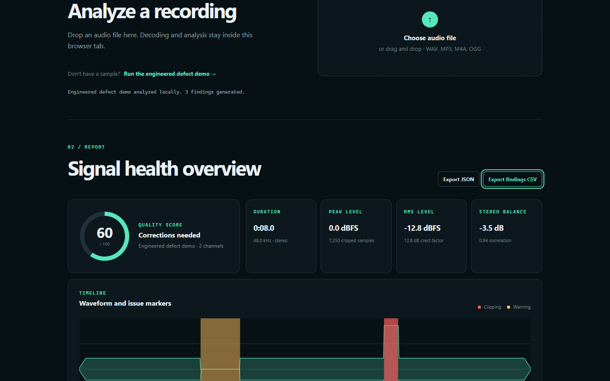

# SignalScope

[](https://github.com/ipricetyler-spec/signalscope-audio-qa/actions/workflows/ci.yml)
[](./LICENSE)

**[Open the live demo](https://ipricetyler-spec.github.io/signalscope-audio-qa/)**

SignalScope is a privacy-first browser audio QA workbench. It decodes user-selected recordings locally, summarizes the waveform, detects configured signal defects, and exports structured reports without a backend.



## Demonstrated capabilities

- WAV, MP3, M4A, OGG, and other formats supported by the current browser decoder.
- Peak and RMS measurement in dBFS.
- Crest-factor, DC-offset, stereo-balance, and correlation measurements.
- Timestamped clipping-region and extended-silence detection.
- Deterministic quality score with explicit rules.
- Canvas waveform with issue markers.
- JSON and CSV report downloads.
- Drag-and-drop input, keyboard focus styles, semantic tables, live status, reduced-motion support, and responsive layouts.
- Local-only analysis: there is no server, authentication, telemetry, or file upload.

The built-in demonstration signal intentionally contains clipping, silence, and channel imbalance so the complete workflow is visible without an external file.

## Run

Requires Bun 1.3+.

```powershell
bun install
bun run check
bun run dev
```

The development server binds to `127.0.0.1` by default. Use the localhost URL printed by Vite.

## Scope and limitations

SignalScope is a deterministic engineering prototype, not a replacement for calibrated loudness tooling or human listening review.

- RMS is not LUFS. No EBU R128 or ITU-R BS.1770 conformance is claimed.
- Clipping is inferred at 99% full scale; inter-sample peaks are not measured.
- Silence detection uses a fixed −48 dBFS amplitude threshold and a 450 ms minimum duration.
- Stereo balance is an average RMS comparison, not perceptual localization.
- Browser codec support varies by operating system and browser.

See [ARCHITECTURE.md](./ARCHITECTURE.md) for implementation details and [PORTFOLIO_CASE_STUDY.md](./PORTFOLIO_CASE_STUDY.md) for a concise portfolio presentation.

## Contributing and security

Focused contributions are welcome. Read [CONTRIBUTING.md](./CONTRIBUTING.md) and the maintainer invariants in [AGENTS.md](./AGENTS.md) before changing analysis behavior. Report vulnerabilities privately as described in [SECURITY.md](./SECURITY.md).
